# Testing Setup

- Testing Framework: Vitest
- UI Testing: @testing-library/react
- Mocking: vi.mock()
- Environment: jsdom

---

#  1. Authentication & Role Testing

## Files:
- `tests/role.test.ts`
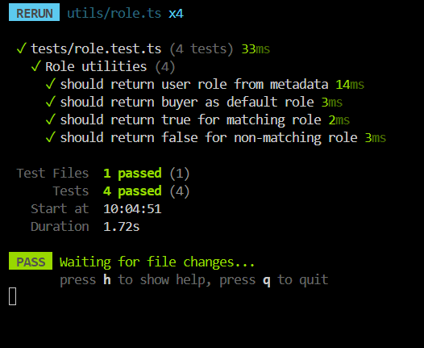

## What is tested:

- Extracting user role from Clerk session
- Default role fallback when metadata is missing
- Role-based access validation

## Test cases:

✔ should return user role from metadata  
✔ should return buyer as default role  
✔ should return true for matching role  
✔ should return false for non-matching role  

---

# 2. Farmer Registration Testing

## Files:
- `tests/registerFarmer.test.ts`
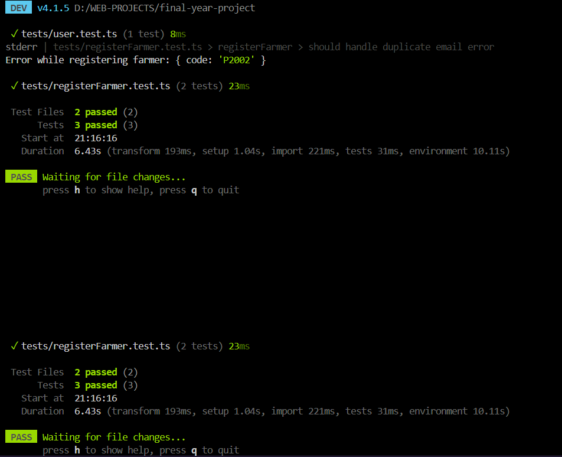
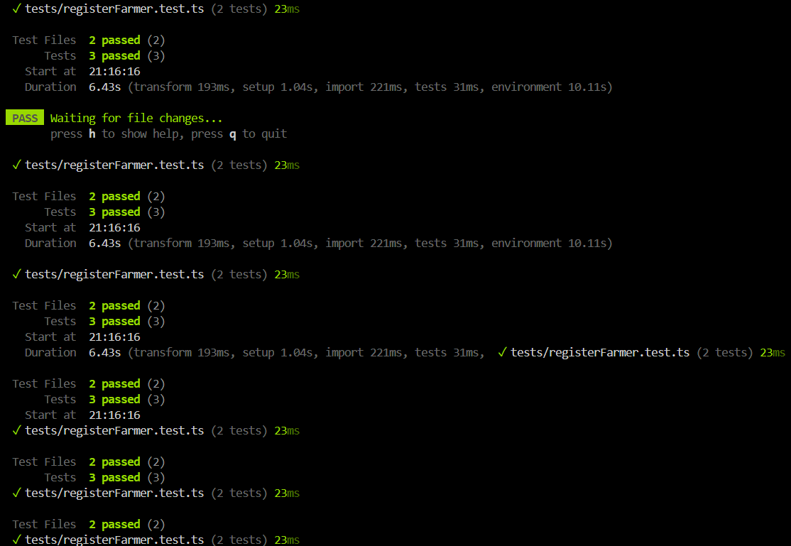
## What is tested:

- Farmer creation in database
- Farmer update functionality
- Duplicate email handling (Prisma error P2002)
- Clerk role update integration

## Test cases:

✔ should register farmer successfully  
✔ should handle duplicate email error  
✔ should update farmer details  

---

# 👤 3. User Management Testing

## Files:
- `tests/getAllUsers.test.ts`
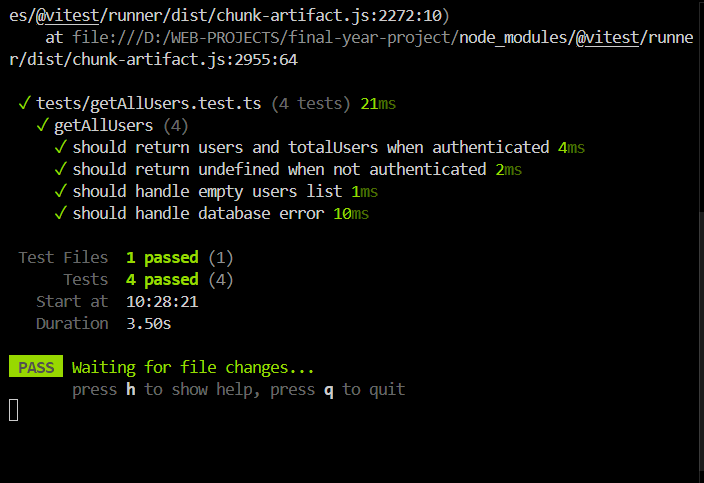

## What is tested:

- Authenticated user retrieval
- Unauthorized access handling
- Empty database handling
- Database error handling

## Test cases:

✔ should return users and totalUsers when authenticated  
✔ should return unauthorized when not authenticated  
✔ should handle empty users list  
✔ should handle database errors  

---

# 💰 4. Revenue Calculation Testing

## Files:
- `tests/getTotalRevenue.test.ts`
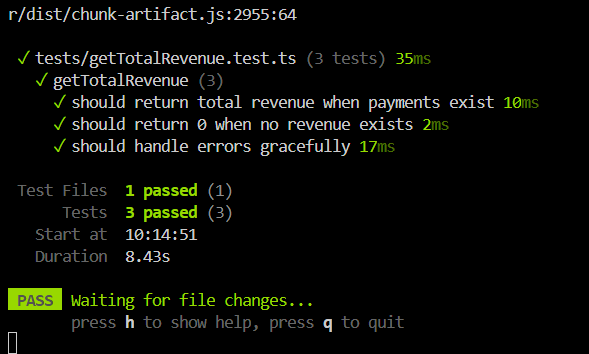
## What is tested:

- Payment aggregation using Prisma
- Revenue calculation correctness
- Handling null values
- Error handling

## Test cases:

✔ should return total revenue when payments exist  
✔ should return 0 when no revenue exists  
✔ should handle database errors gracefully  

---

## Files:s
`tests/chapa.initialize.test.ts`
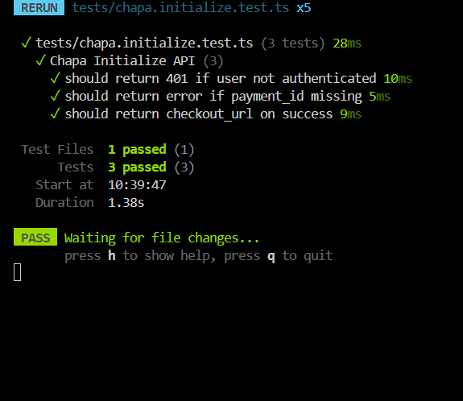
What is tested:
User authentication before payment initialization
Validation of required input (payment_id)
Integration with Chapa payment gateway (mocked)
Database update for transaction reference
Successful checkout URL generation
Test cases:

✔ should return 401 if user not authenticated
✔ should return error if payment_id is missing
✔ should return checkout_url on successful initialization

---

# 5 Chapa Callback API Tests

## Tested Features

### 1. Missing tx_ref
- Ensures callback redirects to failed page when tx_ref is missing.

### 2. Payment Not Found
- Ensures callback redirects to failed page when payment does not exist.

### 3. Already Paid Payment
- Ensures callback redirects to failed page when payment status is already PAID.

### 4. Successful Payment Flow
- Verifies:
  - payment lookup
  - payment verification
  - successful redirect
  - transaction flow execution

## Result
All callback API tests passed successfully using Vitest mocks. 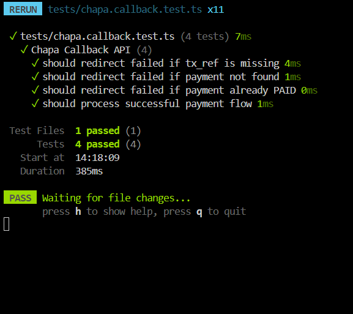

# 6 Orders Page Tests
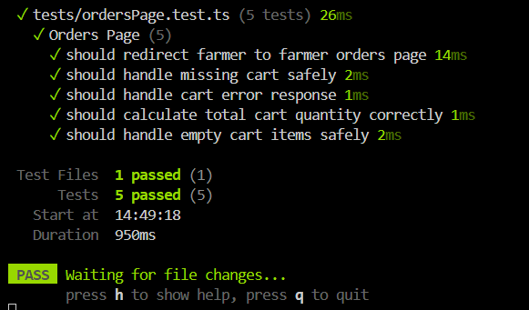
## What is tested

### 1. Farmer redirect
- If user role is "farmer"
- Redirect to `/farmer/orders`

### 2. Missing cart
- If cart is null
- Page should not crash

### 3. Cart error
- If cart returns `{ error: true }`
- Page handles it safely

### 4. Cart quantity calculation
- Sum all item quantities correctly

### 5. Empty cart
- If items array is empty
- No errors, quantity = 0

## Summary
Orders page correctly handles:
- authentication
- role-based redirect
- cart fetching
- safe rendering

# 7 getAllUnreadNotifications Tests
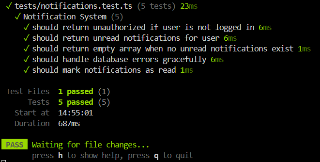
## 1. Unauthorized user
- If no `userId`
- Return:
  - success: false
  - error: true
  - message: "Unauthorized"

---

## 2. Fetch unread notifications
- If user is logged in
- Return only notifications where:
  - user_id matches current user
  - read = false
- Sorted by newest first (createdAt desc)

---

## 3. Empty notifications
- If no unread notifications exist
- Return:
  - success: true
  - data: []

---

## 4. Error handling
- If database fails
- Return:
  - success: false
  - error: true
  - message: "Something went wrong while fetching notifications"

---

## Summary
Ensures notification system:
- protects unauthorized access
- returns only unread notifications
- handles empty state safely
- handles database errors gracefully

# 8 Payout System Tests

## 1. Payout creation on successful order
- When order is paid
- Payout should be created for farmer
- Amount should match order total

---

## 2. Correct farmer assignment
- Each payout must belong to correct farmer
- Derived from product in order

---

## 3. Total amount calculation
- Sum: quantity × price
- Must match payout amount

---

## 4. Multiple orders handling
- If payment has multiple orders
- Each order creates separate payout

---

## 5. Missing product safety
- If product not found
- System should throw error

---

## 6. Database failure handling
- If payout creation fails
- Transaction should rollback

---

## Summary
Ensures payout system is:
- accurate
- farmer-safe
- transaction-safe
- multi-order compatible

# 9 End-to-End Checkout Flow Tests
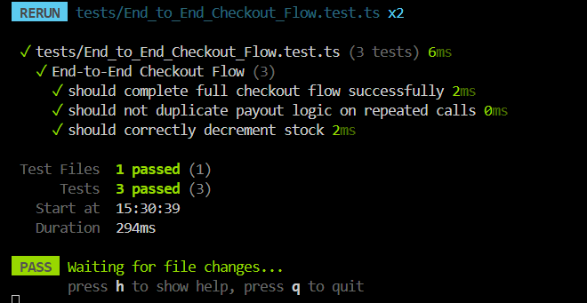
## 1. Successful checkout flow
- User has cart
- Payment initialized
- Chapa callback confirms payment
- System should:
  - mark payment PAID
  - mark orders PAID
  - reduce product stock
  - create payout
  - create notification

---

## 2. Payment failure flow
- If Chapa verification fails
- Redirect to failed page
- No DB updates happen

---

## 3. Duplicate callback safety
- If payment already PAID
- System should NOT:
  - update stock again
  - create duplicate payout

---

## 4. Multi-order payment
- One payment can include multiple orders
- Each order:
  - updates status
  - generates payout separately

---

## 5. Stock safety check
- Stock must never go negative
- Quantity must be decremented correctly

---

## 6. Notification creation
- One notification per order
- Must include correct user and order ID

---

## Summary
This ensures full system reliability from payment to farmer payout.

# 10 createOrder Test Documentation
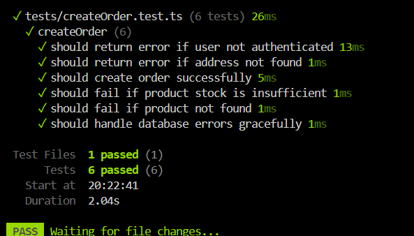
## Tested Features
- User authentication check
- Address existence validation
- Successful order creation
- Product stock validation
- Product existence validation
- Database error handling

## Test Cases
1. Returns error when user is not authenticated
2. Returns error when address is missing
3. Successfully creates order and payment
4. Prevents order when stock is insufficient
5. Returns error when product is not found
6. Handles database errors gracefully

## Mocked Services
- Clerk auth
- Prisma database methods
- Prisma transaction

## Expected Result
All createOrder business logic works correctly and safely handles failures.

<!-- CHAT WORK FLOW -->

1. Authentication (Clerk)
User logs in using Clerk
auth() gives userId
Protected routes like /chats and /chats/[userId]
2. Chat List Page (/chats)
getUserMatches() fetches matches from Supabase
Match = relationship between user1_id and user2_id
You also fetch:
Prisma users (for display info)
notifications + cart count
ChatClient renders all conversations
3. Open Chat (/chats/[userId])
Route receives otherUserId
Checks if match exists in Supabase
Fetches otherUser from Prisma
Passes user into StreamChatInterface
4. Stream Chat Initialization

Inside StreamChatInterface:

Calls getStreamUserToken()
creates Stream user token
connects user to Stream
Calls createOrGetChannel(otherUserId)
checks Supabase match exists
creates deterministic Stream channel ID
creates/gets Stream channel
5. Real-Time Chat (Stream)
channel.watch() subscribes to messages
Loads last 50 messages from Stream
Listens for:
message.new
typing.start / stop
6. Sending Messages
User types message
channel.sendMessage({ text })
Stream broadcasts message to both users instantly
UI updates via event listener
   Important Note
   You are NOT storing messages in your database
   Supabase sendMessage() is not part of real chat flow
✅ Stream is the ONLY message system
✅ Supabase is only for matches/users

# Why Our Playwright Auth Test is Failing (Clerk MFA Issue)

##  The Root Problem

Your Playwright authentication test is failing because **Clerk Multi-Factor Authentication (MFA) is enabled**.

Playwright cannot automatically complete MFA (OTP verification), so the login flow stops.

---
